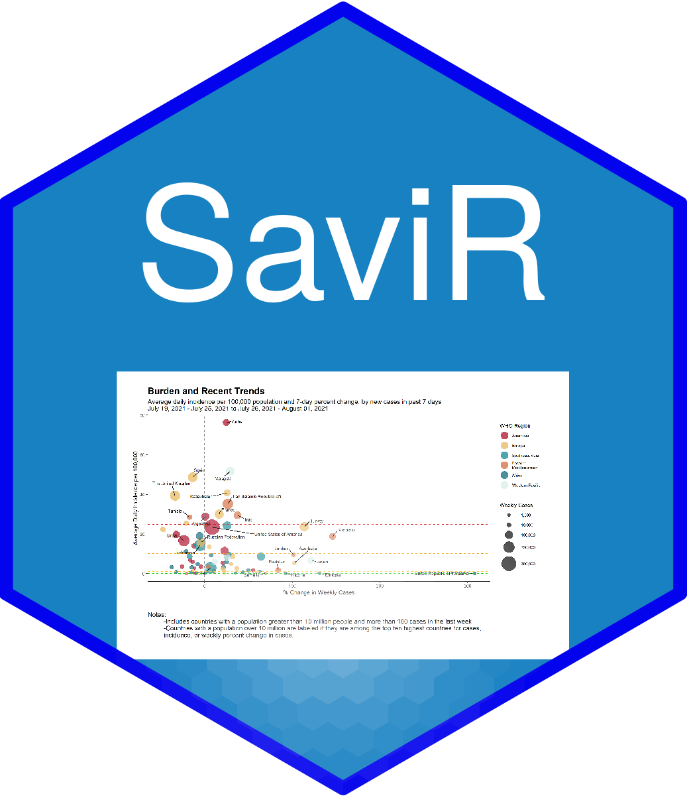

<!-- README.md is generated from README.Rmd. Please edit that file -->

# SaviR 

<!-- badges: start -->
<!-- badges: end -->

The goal of SaviR is to collect the functions needed to access and
prepare various COVID data sources.

This package is divided into two main sections: analytical datasets and
data visualizations.

## Installation

You can install the released version of SaviR from
[Github](https://github.com/randyyee/SaviR) with:

``` r
devtools::install_github("randyyee/SaviR")
```

## COVAD - COVID Analytical Datasets

| Metadata Functions   | Get Functions       | Calculation Functions | Production Functions |
|----------------------|---------------------|-----------------------|----------------------|
| get\_one\_table      | get\_covid\_sources | calc\_add\_risk       | prod\_sitrep         |
| get\_country\_coords | get\_testing        |                       |                      |
|                      | get\_vaccinations   |                       |                      |

-   Metadata is stored in this package and can be called:

``` r
metadata <- onetable  
country_coordinates <- country_coords  
```

## COVAC - COVID Analytical Checks

IN DEVELOPMENT

## COVIS - COVID Visualizations

| Plot Functions              | Map Functions     | Table Functions        |
|-----------------------------|-------------------|------------------------|
| plot\_epicurve              | map\_template     | table\_10mostcases     |
| plot\_epicurve\_ind         | map\_burden       | table\_10mostincidence |
| plot\_epicurve\_epidouble   | map\_trend        | table\_10percentchange |
| plot\_epicurve\_dailydouble | map\_vaccinations | table\_10vaccinations  |
| plot\_riskmatrix            |                   |                        |
| plot\_vaxcoverage           |                   |                        |

***

**DISCLAIMER**:
Use of this service is limited only to non-sensitive and publicly available data. Users must not use, share, or store any kind of sensitive data like health status, provision or payment of healthcare, Personally Identifiable Information (PII) and/or Protected Health Information (PHI), etc. under ANY circumstance.Administrators for this service reserve the right to moderate all information used, shared, or stored with this service at any time. Any user that cannot abide by this disclaimer and Code of Conduct may be subject to action, up to and including revoking access to services. The material embodied in this software is provided to you "as-is" and without warranty of any kind, express, implied or otherwise, including without limitation, any warranty of fitness for a particular purpose. In no event shall the Centers for Disease Control and Prevention (CDC) or the United States (U.S.) government be liable to you or anyone else for any direct, special, incidental, indirect or consequential damages of any kind, or any damages whatsoever, including without limitation, loss of profit, loss of use, savings or revenue, or the claims of third parties, whether or not CDC or the U.S. government has been advised of the possibility of such loss, however caused and on any theory of liability, arising out of or in connection with the possession, use or performance of this software.

**PUBLIC DOMAIN NOTICE**: This repository constitutes a work of the United States Government and is not subject to domestic copyright protection under 17 USC § 105. This repository is in the public domain within the United States, and copyright and related rights in the work worldwide are waived through the CC0 1.0 Universal public domain dedication. All contributions to this repository will be released under the CC0 dedication. By submitting a pull request you are agreeing to comply with this waiver of copyright interest.

**LICENSE STANDARD NOTICE**:
The repository utilizes code licensed under the terms of the Apache Software License and therefore is licensed under ASL v2 or later. This source code in this repository is free: you can redistribute it and/or modify it under the terms of the Apache Software License version 2, or (at your option) any later version. This source code in this repository is distributed in the hope that it will be useful, but WITHOUT ANY WARRANTY; without even the implied warranty of MERCHANTABILITY or FITNESS FOR A PARTICULAR PURPOSE. See the Apache Software License for more details. You should have received a copy of the Apache Software License along with this program. If not, see http://www.apache.org/licenses/LICENSE-2.0.html The source code forked from other open source projects will inherit its license.

**PRIVACY STATEMENT**:
This repository contains only non-sensitive, publicly available data and information. All material and community participation is covered by the Disclaimer and Code of Conduct. For more information about CDC's privacy policy, please visit http://www.cdc.gov/other/privacy.html.

**CONTRIBUTING STANDARD NOTICE**:
Anyone is encouraged to contribute to the repository by forking and submitting a pull request. (If you are new to GitHub, you might start with a basic tutorial.) By contributing to this project, you grant a world-wide, royalty-free, perpetual, irrevocable, non-exclusive, transferable license to all users under the terms of the Apache Software License v2 or later. All comments, messages, pull requests, and other submissions received through CDC including this GitHub page may be subject to applicable federal law, including but not limited to the Federal Records Act, and may be archived. Learn more at http://www.cdc.gov/other/privacy.html.

**RECORDS MANAGEMENT NOTICE**:
This repository is not a source of government records, but is a copy to increase collaboration and collaborative potential. All government records will be published through the CDC web site.

**ADDITIONAL STANDARD NOTICES**:
Please refer to CDC's Template Repository for more information about contributing to this repository, public domain notices and disclaimers, and code of conduct.
